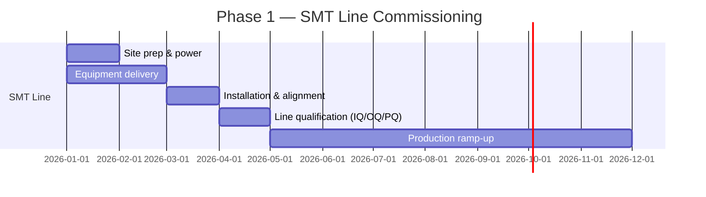
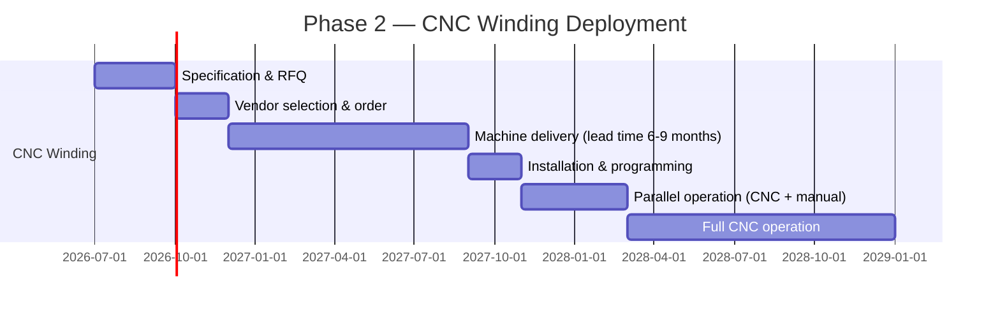

# Automation Roadmap

**Factory:** Coo-Cah Garage & Power Electronics Factory, Sagamu, Ogun State
**Document Ref:** CCG-PE-AUTO-001 | **Version:** 1.0

> This roadmap follows the Coo-Cah group automation phases framework defined in
> `docs/automation/phases.md` within [Coo-Kah-Doks](https://github.com/oumar-code/Coo-Kah-Doks).
> This factory uses the **DISCRETE ELECTRONICS** assembly automation model.

---

## Executive Summary

| Phase | Period | Automation Level | Key Milestone |
|---|---|---|---|
| Phase 1 | 2025–2026 | Semi-automated (SMT + manual winding + AMR) | Factory operational; all products tested; MES live |
| Phase 2 | 2027–2028 | Advanced (CNC winding + AI Vision QC + Digital Twin) | CNC winding — biggest productivity leap |
| Phase 3 | 2029–2031 | High (lights-out night shift on strips/UPS; AI diagnostics) | 700,000 inverters/year; 1.5M power strips/year |

---

## Phase 1 — Foundation (2025–2026)

### Objectives
- Factory fully operational with all Phase 1 products in production
- MES deployed across all zones from Day 1
- 100% load bank testing of every inverter, UPS, and SCC — non-negotiable
- Internal Coo-Cah supply chain served before commercial sales begin

### 1.1 SMT Line — Fully Automated

The SMT PCB production line is fully automated from Day 1. This is the correct design choice:
SMT is a well-understood, equipment-intensive process where automation delivers immediate
quality and yield benefits.



| Capability | Phase 1 | Automation Type |
|---|---|---|
| Solder paste printing | DEK Horizon; auto squeegee | Fully automated |
| Component placement | Yamaha YSM20R + YSM10R (75,000 + 22,500 CPH) | Fully automated |
| Solder paste inspection | Koh Young Zenith 3D | Fully automated |
| Reflow | Heller 10-zone; nitrogen | Fully automated |
| AOI (post-reflow) | Koh Young Zenith 2 3D | Fully automated |
| Wave solder (THT) | Rehm Versaflow | Semi-automated (board loading/unloading manual) |
| In-circuit test | Keysight 3070 | Semi-automated |
| Depanelling | LPKF router | Fully automated |

### 1.2 Transformer Winding — Manual (Phase 1 Critical Note)

> **⚠️ This is the most important distinction in this factory's Phase 1 design.**
>
> Transformer winding is the **most labour-intensive and precision-demanding operation** in this
> factory — not SMT. A large inverter (3kVA–5kVA) contains a toroidal transformer that requires
> precise layer winding, correct wire tension, and careful insulation between layers.
> Getting this wrong causes the unit to fail the load bank test or, worse, fail in the field.
>
> In Phase 1, all transformer and inductor winding is **manual**, performed by trained winders
> on semi-automated winding machines that control tension and layer counts but require human
> setup and supervision. This is NOT a cost-cutting measure — it is the correct approach while:
> 1. The product designs are still being refined and winding parameters adjusted.
> 2. The winder skill base is being built (skill takes 3–6 months to develop properly).
> 3. CNC winding machines are specified, procured, and delivery lead times are long (6–9 months).

| Winding Type | Phase 1 Method | Units/Day (2-shift) | Operators |
|---|---|---|---|
| Toroidal transformers (1–5 kVA) | Semi-auto winding machine + manual | ~120 | 8 winders × 2 machines |
| EI-core transformers (500VA–2kVA) | Semi-auto EI winder + manual | ~200 | 6 winders × 2 machines |
| HF bobbin transformers (SCCs) | Manual bobbin winder | ~400 | 8 winders × 4 machines |
| DC link inductors | Manual inductor winder | ~300 | 4 winders × 2 machines |
| **Total winding staff (Phase 1)** | | | **~40 skilled winders** |

### 1.3 Inverter Firmware Flash — MES Integration

Every inverter MCU is flashed at the firmware flash station. This is a critical traceability step:

```
Firmware Flash Station Flow:
┌─────────────────────────────────────────────────────┐
│ 1. Scan unit barcode (chassis serial number)        │
│ 2. MES confirms correct firmware version for SKU   │
│ 3. Flash MCU via J-Link/ST-Link programmer          │
│ 4. Verify flash checksum                            │
│ 5. MES records: serial number + model code +        │
│    firmware version + flash date + station ID       │
│ 6. Unit proceeds to load bank test                  │
│ 7. Firmware version linked permanently to unit's    │
│    lifetime traceability record                     │
└─────────────────────────────────────────────────────┘
```

**Inverter firmware is flashed BEFORE load bank test — this is intentional:** the load bank test
validates the full system including firmware behaviour under load. The firmware version is
recorded in MES and linked to the unit's serial number for its entire service life.

### 1.4 100% Load Bank Testing — Non-Negotiable Policy

> **POLICY: Every inverter, UPS, and solar charge controller is 100% tested on a load bank
> before packaging. No unit ships without a passed test record in MES. This policy is permanent
> and applies through Phase 1, 2, and 3.**

Rationale:
- Power electronics are inherently complex — a single defective component (bad MOSFET, wrong
  capacitor, improperly wound transformer) can cause catastrophic failure in the field.
- Coo-Cah's 2-year local warranty is a core brand promise. Load bank testing at the factory
  ensures warranty costs remain manageable.
- SON NIS certification requires demonstrated product testing. Having MES-recorded test data
  for every unit shipped is the strongest possible evidence for SON auditors.
- In Phase 3, when production reaches 700,000 inverters/year, the load bank zone will expand
  but the 100% testing policy will not change for inverters and UPS.

### 1.5 MES — Deployed Day 1

The MES is not retrofitted — it is live from the first day of production. This is the group
standard (Coo-Kah-Doks: `docs/mes/integration-standards.md`).

| MES Capability | Phase 1 | Notes |
|---|---|---|
| Serial number generation | ✅ | Format: CCG-[SKU]-[YEAR][MONTH][SEQ6] |
| Work order management | ✅ | All production orders tracked from BOM to finished good |
| Load bank test record | ✅ | Ethernet-connected test stations auto-upload results |
| Firmware flash record | ✅ | Serial + FW version + date logged at flash station |
| SON label print-and-apply | ✅ | MES triggers label printer after passed test |
| Inventory / WMS | ✅ | Stores, WIP, and finished goods |
| AMR fleet integration | ✅ | AMR RCS linked to MES for automatic kitting and delivery |
| Energy monitoring | ✅ | EMS data linked to MES for production-energy correlation |

### 1.6 AMR Fleet — 12 Units from Phase 1

The AMR fleet handles all intra-factory material movement. No manual forklifts within
the production floor.

| Route | AMR Count | Frequency |
|---|---|---|
| Stores → SMT in-feed (component kits) | 3 AMRs | Continuous; re-kits per PCB batch |
| SMT out-feed → Assembly zones | 2 AMRs | Continuous |
| Winding cell → Assembly zone | 2 AMRs | Per production order |
| Assembly → Load bank test queue | 2 AMRs | Per completed unit |
| Load bank → Packaging | 1 AMR | Per completed test |
| Packaging → Warehouse | 2 AMRs | Per carton batch |
| **Total fleet** | **12 AMRs** | |

---

## Phase 2 — Advanced Automation (2027–2028)

### 2.1 CNC Transformer Winding — The Biggest Phase 2 Leap

> **This is the most significant productivity investment in Phase 2 — more impactful than any
> other automation in this factory.**
>
> A CNC transformer winding machine (e.g., MARSILLI Globetrotter, Gorman-Rupp CNC series, or
> Aumann) can wind a 3kVA toroidal transformer in ~8 minutes vs. ~35–45 minutes for a skilled
> manual winder. At 200,000 inverters/year, even a 2× improvement in winding throughput
> significantly reduces headcount in the highest-skill zone.



| Capability | Phase 1 | Phase 2 (CNC) | Improvement |
|---|---|---|---|
| Toroidal winding (3kVA) | 35–45 min/unit manual | 8–10 min/unit CNC | **4× throughput** |
| EI-core winding | 25–35 min/unit manual | 6–8 min/unit CNC | **4× throughput** |
| Winding staff required | ~40 winders | ~12 CNC operators | **28 positions redeployed** |
| Winding defect rate | ~1.5% (human error) | <0.3% (CNC precision) | **80% defect reduction** |
| Winding consistency (turns count) | ±1% (manual) | ±0.05% (CNC encoder) | **20× precision** |

**CNC winding machine deployment plan:**
- 2 × CNC toroidal winding machines (replace 2 manual machines)
- 2 × CNC EI-core winding machines (replace 2 manual machines)
- 4 × CNC HF bobbin winders (replace 4 manual machines)
- Retained: 2 × manual winders for prototype/NPI (new product introduction)

### 2.2 AI Vision QC on SMT Line

Deploy AI vision QC at the post-reflow AOI station. The existing Koh Young AOI uses rule-based
inspection; AI adds learning-based false-call reduction and anomaly detection.

| Capability | Phase 1 (Rule-based AOI) | Phase 2 (AI Vision) | Improvement |
|---|---|---|---|
| False call rate | ~0.5% | <0.1% | **5× reduction** |
| Novel defect detection | Limited | Learns from field returns | Continuous improvement |
| Solder joint anomaly | Geometric rules only | Texture + geometry + context | Better detection |
| Process feedback | Weekly reports | Real-time SPC → process adjustment | Faster correction |

### 2.3 Digital Twin — Phase 2 Live

The digital twin for inverter assembly cells and winding cells becomes live in Phase 2.
Phase 1 data collection lays the foundation.

| Digital Twin Asset | Phase 1 | Phase 2 |
|---|---|---|
| SMT line | Data collection only | Full DT with real-time process state |
| Winding cell | Data collection only | CNC machines stream telemetry; DT predicts tool wear |
| Load bank test zone | Full MES integration | DT correlates test results with production data |
| Energy systems | EMS monitoring | DT models energy vs. production output |

### 2.4 Predictive Maintenance

Phase 2 introduces predictive maintenance on the highest-risk equipment:

| Equipment | Sensor | Prediction | Action |
|---|---|---|---|
| Reflow oven (SMT-05) | Zone temperature sensors; heater element current | Heater element degradation | Pre-emptive element replacement at 90% EOL |
| CNC winding motors | Vibration + current | Bearing wear | Bearing replacement scheduling |
| Compressor | Vibration + temperature + pressure | Air end wear | Service scheduling |
| Load bank contactors | Contact resistance measurement | Contact wear | Replacement before failure |

---

## Phase 3 — High Automation & Full Capacity (2029–2031)

### 3.1 Lights-Out Night Shift

> **Phase 3 lights-out specifically targets power strips (CCG-PS) and UPS — NOT inverters.**
>
> Inverters and solar charge controllers require **human sign-off on each unit** through Phase 3
> for warranty and regulatory purposes. The load bank test is automated, but a human quality
> technician reviews the test certificate and authorises dispatch.
>
> Power strips are far simpler: PCB assembly (SMT), enclosure assembly (snap-fit), and a
> continuity/function test. This is automatable to lights-out standard.

| Product | Lights-Out? | Reason |
|---|---|---|
| CCG-PS (Power Strips) | ✅ Yes — Phase 3 | Simple assembly; automated test; no regulatory human sign-off |
| CCG-UPS | ✅ Yes — Phase 3 | Structured assembly; test automatable; volume justifies lights-out |
| CCG-INV-PSW / MSW | ❌ No — human sign-off required | IEC 62040 warranty record; SON NIS compliance; load bank cert |
| CCG-SCC-MPPT / PWM | ❌ No — through Phase 3 | SCC test bench requires human review; lower volume anyway |
| CCG-PT (Power Tools) | 🔄 Partial — evaluation | Motor sub-assembly automatable; final assembly TBD |

### 3.2 AI Failure Diagnostics

Phase 3 deploys AI-driven automatic failure diagnostics for units that fail the load bank test:

```
Unit fails load bank test
         ↓
AI Diagnostic Engine analyses:
  - Failure mode (voltage, frequency, THD, temperature)
  - SMT AOI results for this unit's PCB
  - Winding test data for this unit's transformer
  - Firmware version anomalies
  - Historical failure pattern database
         ↓
Root cause report generated in < 5 minutes
         ↓
Technician directed to specific repair action
         ↓
Unit repaired and re-tested
         ↓
Root cause logged → fed back to process SPC
```

**Target:** Root cause identification for 80% of failures in < 5 minutes (Phase 3 KPI).

### 3.3 Phase 3 Capacity Targets

| Product Line | Phase 1 | Phase 3 | Expansion Factor |
|---|---|---|---|
| Inverters | 200,000/year | 700,000/year | 3.5× |
| Solar Charge Controllers | 150,000/year | 500,000/year | 3.3× |
| Battery Chargers | 80,000/year | 250,000/year | 3.1× |
| Power Strips | 500,000/year | 1,500,000/year | 3.0× |
| UPS | 50,000/year | 250,000/year | 5.0× |
| Power Tools | 100,000/year | 500,000/year | 5.0× |

---

## Automation KPI Dashboard

| KPI | Phase 1 Target | Phase 2 Target | Phase 3 Target |
|---|---|---|---|
| SMT First Pass Yield (FPY) | ≥ 95% | ≥ 98% | ≥ 99% |
| Winding Defect Rate | < 2% | < 0.3% | < 0.1% |
| Load Bank Test Pass Rate | ≥ 92% | ≥ 96% | ≥ 98% |
| Load Bank False Failure Rate | < 2% | < 0.5% | < 0.1% |
| AMR On-Time Kitting | ≥ 95% | ≥ 99% | ≥ 99.5% |
| MES Traceability Coverage | 100% | 100% | 100% |
| AI Diagnostic Root Cause < 5 min | N/A | N/A | ≥ 80% of failures |
| Overall Equipment Effectiveness (SMT) | ≥ 75% | ≥ 85% | ≥ 90% |
| Energy per Inverter Produced | Baseline | -15% vs Phase 1 | -25% vs Phase 1 |

---

## Automation Investment Summary

| Phase | Key Investment | CapEx (USD estimate) | NPV Driver |
|---|---|---|---|
| Phase 1 | SMT line, AMR fleet, MES, load banks, energy system | $5.2M | Factory operational; internal supply |
| Phase 2 | CNC winding machines, AI Vision upgrade, Digital Twin | $1.8M | 4× winding throughput; 28 positions redeployed |
| Phase 3 | Lights-out assembly block, AI diagnostics platform | $2.5M | 1.5M power strips/year; night-shift output |
