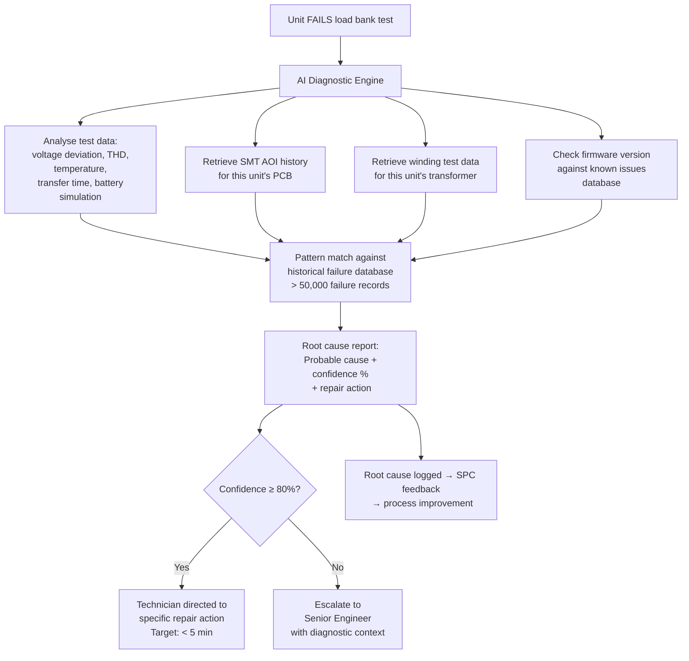

# Digital Twin

**Factory:** Coo-Cah Garage & Power Electronics Factory, Sagamu, Ogun State
**Document Ref:** CCG-PE-DTWIN-001 | **Version:** 1.0

> This document follows the Coo-Cah group digital twin architecture defined in
> <a href="https://github.com/oumar-code/Coo-Kah-Doks/blob/main/platform/digital-twin-platform-architecture.md">platform/digital-twin-platform-architecture.md</a>
> within <a href="https://github.com/oumar-code/Coo-Kah-Doks">Coo-Kah-Doks</a>.
> **Platform decision: Hybrid Coo-Cah DT Engine (not Azure Digital Twins / AWS TwinMaker)
> — see ADR-003 in Coo-Kah-Doks.**

---

## 1. Digital Twin Strategy

The Coo-Cah Power Electronics Factory digital twin is built in three phases, aligned with the
automation roadmap:

| Phase | Period | DT Maturity | Key Capability |
|---|---|---|---|
| Phase 1 | 2025–2026 | **Data foundation** — sensors in, data collected | Asset registry; load bank test data; energy monitoring; MES integration |
| Phase 2 | 2027–2028 | **Live process twin** — real-time operational state | SMT + CNC winding DT live; predictive maintenance; AI anomaly detection |
| Phase 3 | 2029–2031 | **Predictive factory** — autonomous optimisation | Full factory DT; AI scheduling; lights-out process control |

---

## 2. Phase 1 — Asset Registry & Data Foundation

### 2.1 Asset Registry

All production equipment, energy assets, and IT systems are registered in the digital twin
asset registry. This is the single source of truth for:
- Asset identity (tag number, make, model, serial, install date)
- Maintenance schedule (last service, next service, planned downtime)
- Sensor data streams (what data flows from each asset)
- Historical performance (OEE, uptime, failure events)

#### SMT Line Assets

| Asset Tag | Equipment | Sensor Streams | DT Phase 1 Capability |
|---|---|---|---|
| SMT-01 | Solder paste printer | Print speed, squeegee pressure, paste height (via SPI feedback) | Data collection; alarm on out-of-spec |
| SMT-02 | SPI (solder paste inspection) | Volume, height, area per joint; board pass/fail | Real-time SPC charts in MES; trend alerts |
| SMT-03 | Pick & place #1 (YSM20R) | CPH, nozzle pick errors, feeder errors, cycle time | OEE calculation; feeder error trending |
| SMT-04 | Pick & place #2 (YSM10R) | CPH, nozzle pick errors, feeder errors | OEE calculation |
| SMT-05 | Reflow oven | All 10 zone temperatures (±0.5°C), board speed, atmosphere O₂% | Temperature profile archive per board type; alarm on drift |
| SMT-06 | AOI (post-reflow) | Pass/fail per joint; defect category; board ID | Defect Pareto; SPC on defect rate; correlation to reflow profile |
| SMT-07 | Wave solder | Wave height, solder temperature, flux volume, board speed | Process recipe archive; solder bath temp trending |
| SMT-08 | ICT tester | Pass/fail per board; failure code; test time | Yield tracking; component failure analysis |
| SMT-09 | Depanelling router | Spindle speed, feed rate, dust extraction pressure | Blade life tracking |

#### Winding Cell Assets (Phase 1 — Semi-manual, data from test station)

| Asset Tag | Equipment | Sensor Streams | DT Phase 1 Capability |
|---|---|---|---|
| WND-01/02 | Toroidal winding machines | Turns counted (manual entry); wire tension; machine cycle time | Winding batch tracking; turns vs. spec comparison |
| WND-05 | Varnish tank | Vacuum level, pressure cycle time, temperature | Process log; cure cycle archive |
| WND-06/07 | Transformer test stations | Turns ratio, DCR, inductance, leakage, Hi-Pot result per unit | **100% of wound components tested; results in MES; linked to unit serial** |

#### Load Bank Test Zone Assets

| Asset Tag | Equipment | Sensor Streams | DT Phase 1 Capability |
|---|---|---|---|
| TST-01 × 6 | Resistive load banks | Power (kW), voltage, current, frequency, test duration | **Real-time test results to MES; automatic pass/fail logged against serial number** |
| TST-02 × 4 | Power quality analysers | Voltage THD, current THD, PF, harmonics | Waveform archive per unit; SPC on THD |
| TST-05 × 4 | Hi-Pot testers | Test voltage, leakage current, pass/fail | Hi-Pot result logged per serial; mandatory field in MES before label |
| TST-08 × 3 | SCC test benches | MPPT efficiency, charge current accuracy, voltage regulation | All SCC test results in MES |

### 2.2 Energy Monitoring Integration

The EMS (Schneider EcoStruxure PME) feeds all sub-meter data to the digital twin in real time.

| Data Stream | Frequency | DT Use |
|---|---|---|
| Solar PV output (total + per string) | 1-minute | Yield monitoring; shade analysis; string fault detection |
| BESS SoC, power in/out, temperature | 1-minute | BESS health tracking; dispatch optimisation |
| Main incomer (grid) | 1-minute | DISCO billing reconciliation; self-sufficiency calculation |
| Generator run hours + fuel consumed | Per event | Cost-per-kWh calculation; emissions reporting |
| SMT line energy | 5-minute | Energy per PCB panel produced |
| Load bank test zone energy | Per test event | Energy per unit tested |
| Compressed air (kWh + m³) | 5-minute | Energy/m³ efficiency; leak detection (night-time baseline) |
| Building HVAC | 15-minute | Seasonal benchmarking; setpoint optimisation |

### 2.3 MES Integration (Phase 1 DT Scope)

The MES is the operational layer; the digital twin is the analytical and monitoring layer.
Data flows from MES to DT in near-real-time (< 5-minute lag via REST API or MQTT broker).

```mermaid
graph TD
    A[MES - Production Layer] -->|REST API / MQTT| B[Digital Twin Platform]
    C[EMS - Energy Layer] -->|Modbus TCP / REST| B
    D[Test Equipment - Ethernet| Load bank, AOI, SPI] -->|MQTT / OPC-UA| A
    E[AMR Fleet - RCS] -->|REST API| A
    B --> F[Digital Twin Dashboard]
    B --> G[Predictive Maintenance Engine Phase 2]
    B --> H[AI Diagnostics Engine Phase 3]
    F --> I[Factory Manager - Real-time View]
    F --> J[Group MES - Coo-Kah-Doks Integration]
```

---

## 3. Phase 2 — Live Process Twin (2027–2028)

### 3.1 SMT Digital Twin

In Phase 2, the SMT digital twin becomes a **live process simulation** that mirrors the real
SMT line in real time:

| Capability | Description |
|---|---|
| Real-time process state | All machine states (running, idle, faulted) visible on DT dashboard |
| Process recipe management | DT holds master recipes; pushes to machines; detects unauthorised deviations |
| SPC (Statistical Process Control) | Automated Xbar-R charts on all critical SMT parameters; alerts on out-of-control |
| Predictive nozzle wear | CPH trending + pick error rate → predicts nozzle replacement need 24h in advance |
| Thermal profile optimisation | DT compares reflow oven profiles across product variants; recommends optimal profiles |

### 3.2 CNC Winding Cell Digital Twin

CNC winding machines (deployed in Phase 2) stream telemetry to the DT:

| Telemetry Stream | Use |
|---|---|
| Turns counter (encoder) | Verify turns vs. specification for every transformer in real time |
| Wire tension (load cell) | Monitor tension drift → predicts broken wire events |
| Spindle motor current | Tracks motor wear; predicts bearing replacement |
| Winding program ID | Confirms correct program loaded for each product variant |
| Winding cycle time | OEE calculation; throughput optimisation |

### 3.3 Predictive Maintenance Engine

Phase 2 activates the predictive maintenance engine for high-criticality assets:

| Asset | Prediction Method | Lead Time | Alert Action |
|---|---|---|---|
| Reflow oven heater elements | Temperature trend vs. historical failure curves | 1–2 weeks | Work order raised in MES |
| SMT pick-and-place nozzles | Pick error rate trend | 24–48 hours | Nozzle change work order |
| CNC winding motor bearings | Vibration FFT analysis | 2–4 weeks | Maintenance scheduled |
| Compressor air end | Vibration + temperature | 4–8 weeks | Service scheduled |
| Load bank contactors | Contact resistance measurement | 2–4 weeks | Contactor replacement scheduled |

---

## 4. Phase 3 — Predictive Factory (2029–2031)

### 4.1 Full Factory Digital Twin

Phase 3 creates a complete factory-level DT that encompasses:
- All production zones
- All energy systems
- All logistics (AMR fleet real-time position tracking in DT)
- Supply chain visibility (inbound materials ETA from Coo-Cah Plastics, Tin Can Island)

### 4.2 AI Scheduling Optimisation

The Phase 3 DT includes an AI scheduling engine that:

| Optimisation Target | Method |
|---|---|
| SMT production sequence | Minimise feeder change-overs; batch similar board variants |
| Load bank test queue | Prioritise units with oldest wait time; balance load across 6 banks |
| CNC winding schedule | Align with downstream assembly demand; minimise WIP queue |
| AMR routing | Real-time re-routing based on zone congestion detected in DT |
| Energy dispatch | Optimise BESS dispatch for time-of-use savings on residual grid draw |

### 4.3 AI Failure Diagnostics

The Phase 3 AI diagnostics engine analyses failed units on the load bank:



---

## 5. Data Architecture

### 5.1 Data Sources and Protocols

| Data Source | Protocol | Data Type | Update Rate |
|---|---|---|---|
| SMT machines (Yamaha, DEK, Heller) | OPC-UA / Yamaha proprietary API | Process state, parameters, alarms | 1–10 seconds |
| Load bank test stations | Ethernet + Modbus TCP | Test results, waveforms | Per test event |
| CNC winding machines (Phase 2) | OPC-UA | Telemetry, turns count, tension | 1 second |
| EMS (Schneider PME) | REST API + MQTT | Energy sub-meters | 1–5 minutes |
| MES (production data) | REST API | Work orders, serial numbers, test results | Near real-time |
| AMR fleet RCS | REST API | Robot position, task status, battery % | 10 seconds |
| BESS BMS | Modbus TCP | SoC, power, temperature, alarms | 1 minute |
| Solar inverters | Modbus TCP + SunSpec | Output power, string voltages, alarms | 1 minute |

### 5.2 Data Storage

| Data Tier | Storage | Retention | Purpose |
|---|---|---|---|
| Hot (real-time) | TimescaleDB (time-series) | 90 days | Dashboard, real-time alerts |
| Warm (operational) | PostgreSQL + object storage | 3 years | Trend analysis, warranty records |
| Cold (archive) | Object storage (S3-compatible) | 10 years | ISO 50001 records, SON audit evidence |

### 5.3 Integration with Group Platform

The Coo-Cah group digital twin platform (defined in
<a href="https://github.com/oumar-code/Coo-Kah-Doks/blob/main/platform/digital-twin-platform-architecture.md">platform/digital-twin-platform-architecture.md</a>
in Coo-Kah-Doks) aggregates data from all factory twins. This factory publishes:

| Published Data | Frequency | Consumer |
|---|---|---|
| Production output (units/day per SKU) | Daily | Group ERP + operations dashboard |
| Quality KPIs (FPY, load bank pass rate) | Daily | Group quality council |
| Energy self-sufficiency % | Daily | Group sustainability report |
| Inventory levels (key components) | Real-time | Group supply chain visibility |
| Intra-group supply deliveries (CCG-PS, UPS, etc.) | Per shipment | Sister factory MES |
