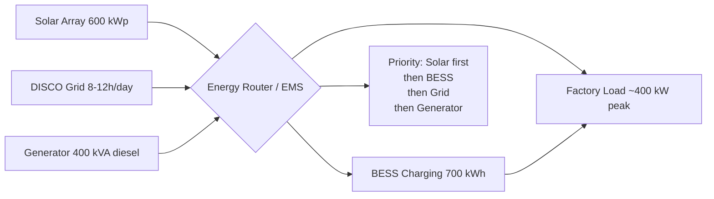

# Energy Profile

**Factory:** Coo-Cah Garage & Power Electronics Factory, Sagamu, Ogun State
**Document Ref:** CCG-PE-ENRG-001 | **Version:** 1.0 | **Phase:** 1

> This document follows the Coo-Cah group energy strategy defined in `docs/energy/strategy.md`
> within [Coo-Kah-Doks](https://github.com/oumar-code/Coo-Kah-Doks).
> Target: ≥ 80% solar self-sufficiency — group-wide standard for all Tier 1 factories.

---

## 1. Site Context — Sagamu, Ogun State

Sagamu (6.8°N, 3.7°E) sits in the humid tropics with the following energy context:

| Parameter | Value |
|---|---|
| Average Daily Solar Irradiance | 4.7 kWh/m²/day (Peak Sun Hours) |
| Worst Month (July) | ~4.5 PSH/day |
| Best Month (February) | ~5.4 PSH/day |
| DISCO (Electricity Supplier) | Ikeja Electric / Ogun State distribution |
| Typical DISCO Grid Availability | 8–12 hours/day |
| Grid Voltage | 415 V AC 3-phase / 240 V AC single-phase |
| Nominal Grid Frequency | 50 Hz |
| Grid Instability Index | HIGH — voltage fluctuations common; outages daily |

**Key implication:** Ogun State grid supply is unreliable enough that the factory cannot depend
on it for production hours. The 600 kWp + 700 kWh system is explicitly sized to achieve
grid-independence during all planned production hours (6:00–22:00), not just as a cost-saving
measure.

---

## 2. Factory Load Analysis

### 2.1 Load Categories

| Zone | Peak Load (kW) | Avg Load (kW) | Hours/Day | Daily kWh |
|---|---|---|---|---|
| SMT Line (full load — reflow oven dominant) | 95 | 65 | 16 | 1,040 |
| Transformer Winding Section | 18 | 12 | 16 | 192 |
| Inverter Assembly Line + Conveyors | 22 | 15 | 16 | 240 |
| Load Bank Test Zone (simultaneous units) | 55 | 35 | 16 | 560 |
| Power Tool Assembly Line | 12 | 8 | 8 | 64 |
| Cable Processing + Misc Assembly | 8 | 5 | 16 | 80 |
| Compressed Air System | 45 | 28 | 16 | 448 |
| AMR Fleet (12 units charging) | 15 | 8 | 16 | 128 |
| Lighting (LED — all zones) | 28 | 25 | 16 | 400 |
| HVAC / Ventilation | 40 | 28 | 16 | 448 |
| Office & Welfare Block | 12 | 8 | 12 | 96 |
| IT / MES / Networking | 10 | 9 | 24 | 216 |
| Miscellaneous / Maintenance | 15 | 8 | 12 | 96 |
| **Estimated Peak (simultaneous)** | **~375–400 kW** | — | — | — |
| **Estimated Daily Consumption** | — | — | — | **~2,800 kWh/day** |

> The reflow oven (SMT-05) and load bank test zone are the dominant loads. The reflow oven draws
> ~60–70 kW during preheat cycles and ~45 kW steady-state. Compressed air is the second largest
> continuous load.

### 2.2 Monthly Load Profile

| Month | Avg Daily kWh | Production Days | Monthly kWh | Notes |
|---|---|---|---|---|
| January | 2,800 | 22 | 61,600 | Normal production |
| February | 2,800 | 20 | 56,000 | Normal production |
| March | 2,850 | 22 | 62,700 | Slight HVAC increase |
| April | 2,850 | 22 | 62,700 | Hot season begins |
| May | 2,900 | 22 | 63,800 | Peak cooling load |
| June | 2,750 | 22 | 60,500 | Wet season — lower HVAC |
| July | 2,700 | 22 | 59,400 | Coolest month |
| August | 2,700 | 22 | 59,400 | Wet season |
| September | 2,750 | 22 | 60,500 | Transition |
| October | 2,800 | 22 | 61,600 | Normal |
| November | 2,850 | 22 | 62,700 | Hot season returns |
| December | 2,600 | 18 | 46,800 | Year-end shutdown |
| **Annual** | | **248** | **~717,700 kWh** | |

---

## 3. Solar PV System Design

### 3.1 System Specification

| Parameter | Value |
|---|---|
| Total PV Capacity | 600 kWp |
| Array Type | Ground-mount (primary) + car park shade canopy (supplementary) |
| Panel Type | Monocrystalline PERC, 400 Wp per panel |
| Number of Panels | ~1,500 panels |
| Panel Manufacturer | Longi Solar LR4-72HPH-440M or JA Solar JAM72S20-440/MR (or equivalent Tier-1) |
| Tilt Angle | 15° south-facing (optimal for 6.8°N latitude) |
| Ground Coverage | ~3,600 m² (ground-mount array east of factory) |
| Car Park Canopy | ~800 m² additional, dual-use: shade + generation |
| String Inverter Capacity | 6 × 100 kW = 600 kW AC-coupled |
| String Inverter Model | Huawei SUN2000-100KTL-H1 or equivalent |
| DC:AC Ratio | 1.0 — conservative for Nigerian heat derating |
| Annual Degradation Rate | 0.55%/year |
| System Efficiency Factor | 78% (shading, wiring, inverter, temperature losses combined) |

### 3.2 Annual Solar Generation Estimate

```
Annual Generation = Capacity × PSH × System Efficiency × Days
                  = 600 kWp × 4.7 PSH/day × 0.78 × 365
                  ≈ 804,000 kWh/year
```

Against annual factory consumption of ~717,700 kWh, the solar array alone covers **~112%**
of total annual demand on paper. However, generation and load do not coincide perfectly —
hence the 700 kWh BESS to store midday surplus for evening production.

### 3.3 Ground-Mount Rationale

| Factor | Ground-Mount | Rooftop |
|---|---|---|
| Structural loading on building | None | ~22 kg/m² (requires engineering check) |
| Land availability | Available (east of factory, ~3,600 m² clear) | 12,000 m² roof but already used for ventilation, AC units |
| Maintenance access | Easy; standard walkways between rows | Requires roof access safety systems |
| Temperature (panel performance) | Lower ambient — 3–5°C cooler than roof | Radiant heat from roof reduces yield ~2% |
| Car park integration | Dual-use canopy provides shade | Not applicable |
| Phase 2 expansion | Additional 200 kWp ground-mount possible | Limited |
| **Decision** | **✅ Ground-mount preferred** | — |

---

## 4. Battery Energy Storage System (BESS)

### 4.1 BESS Specification

| Parameter | Value |
|---|---|
| Usable Capacity | 700 kWh |
| Chemistry | Lithium Iron Phosphate (LFP) |
| Supplier Options | CATL PACK / BYD Battery-Box Premium HV (containerised) |
| Configuration | 2 × 350 kWh containerised units (redundancy; one-at-a-time maintenance) |
| Peak Discharge Power | 400 kW (1C discharge rate) |
| Charge/Discharge Efficiency | 95% round-trip |
| Cycle Life | ≥ 6,000 cycles at 80% DoD — ~16–18 years at 1 cycle/day |
| Calendar Life | 20 years |
| Operating Temperature | -10°C to +55°C |
| BMS | Integrated; remote monitoring via RS485 + Modbus TCP; alerts to MES |
| Container Size | 2 × 20-ft containers; installed on dedicated concrete pad |
| Fire Suppression | Integrated aerosol suppression + external CO₂ |
| Safety Standard | IEC 62619; UN 38.3 transport tested |

### 4.2 BESS Operating Strategy



| Time Period | Primary Source | BESS Role |
|---|---|---|
| 06:00–07:00 (startup) | BESS + Grid | Discharge — covers startup before solar peak |
| 07:00–14:00 (peak solar) | Solar | Charging — surplus stored in BESS |
| 14:00–18:00 (late afternoon) | Solar + BESS | BESS supplements as solar declines |
| 18:00–22:00 (evening shift) | BESS + Grid | Discharge — evening production |
| 22:00–06:00 (off-peak) | Grid | Opportunity charging if available |
| Grid outage (any time) | Solar + BESS | Island mode; generator auto-start if BESS < 20% |

### 4.3 Energy Self-Sufficiency Model

| Scenario | Daily Solar Gen (kWh) | BESS Buffer (kWh) | Factory Use (kWh) | Grid Required (kWh) | Self-Sufficiency |
|---|---|---|---|---|---|
| Best month (Feb) | 600 kWp × 5.4h × 0.78 = **2,527** | 665 (95% usable) | 2,800 | ~273 | **90%** |
| Average month | 600 kWp × 4.7h × 0.78 = **2,199** | 665 | 2,800 | ~601 | **79%** |
| Worst month (Jul) | 600 kWp × 4.5h × 0.78 = **2,106** | 665 | 2,700 | ~594 | **78%** |
| **Target** | — | — | — | — | **≥ 80%** |

> The model confirms the 600 kWp + 700 kWh system achieves the ≥ 80% self-sufficiency target
> in 10+ months of the year, with July being the marginal month at ~78%.
> Increasing PV to 650 kWp would guarantee ≥ 80% in all months — budget permitting.

---

## 5. Backup Generator

| Parameter | Value |
|---|---|
| Rating | 400 kVA / 320 kW (0.8 PF) — Perkins 4016-61TRG3 or equivalent |
| Alternator | Stamford S4L1S-D or equivalent |
| Fuel Type | Diesel — EN 590 |
| Fuel Tank Capacity | 1,500 litres (buried double-wall tank; NESREA compliant) |
| Estimated Runtime | ~60 hours at 40% load (128 kW avg) |
| Auto-Start | Yes — via ATS; starts within 10 seconds of grid failure when BESS < 20% |
| Maintenance Interval | 500-hour oil/filter service; annual major service |
| Location | External generator house (acoustic enclosure; ≤ 75 dB at 1 m) |
| Emissions | Tier 2 / Stage II equivalent; exhaust stack above roofline |

**Generator usage target:** < 200 hours/year (equivalent to ~8 days at full factory operation).
The solar + BESS system should handle all planned production; generator is for emergency backup only.

---

## 6. Power Factor Correction

| Parameter | Value |
|---|---|
| Target PF on DISCO supply | > 0.95 (avoids reactive power surcharges) |
| Automatic PFC Bank | 200 kVAr automatic-switching capacitor bank |
| Harmonic Filtering | Passive detuned reactor banks (7% detuned) — prevents resonance with VFDs |
| Location | Main LV distribution room |
| Monitoring | Integrated with Schneider EcoStruxure Power Monitoring Expert |

---

## 7. Energy Cost Model

### 7.1 DISCO Tariff Assumptions (Ogun State — Ikeja Electric Band A/B)

| Parameter | Value |
|---|---|
| DISCO Tariff (Band A) | ₦240/kWh (2025 estimate, Band A — ≥ 20h supply) |
| DISCO Tariff (Band B) | ₦206/kWh (16–20h supply) |
| Sagamu classification | Band B/C — typically 8–12h/day |
| Applicable Rate Used | ₦215/kWh blended (conservative) |
| Diesel Cost (generator) | ₦1,250/litre (2025 estimate) |
| Diesel Consumption at 40% load | ~60 L/hour |
| Generator Cost/kWh | ~₦468/kWh (significantly more expensive than grid) |

### 7.2 Annual Energy Cost Comparison

| Scenario | Annual Grid kWh | Annual Diesel kWh | Grid Cost (₦M) | Diesel Cost (₦M) | Total (₦M/year) |
|---|---|---|---|---|---|
| **No solar (baseline)** | 717,700 | ~100,000 (outages) | 154.3 | 46.8 | **201.1** |
| **With 600 kWp + BESS (target)** | ~145,000 | ~25,000 | 31.2 | 11.7 | **42.9** |
| **Annual Saving** | | | | | **~₦158.2M/year** |

> **Solar + BESS payback:** CapEx for energy system ~₦930M (USD 1.2M at ₦775/$).
> Annual saving ~₦158M. Simple payback: **~5.9 years** (before electricity tariff escalation,
> which is running at ~30%/year in Nigeria — actual payback likely < 4 years).

### 7.3 Carbon Footprint

| Parameter | Value |
|---|---|
| Nigerian grid emission factor | ~0.43 kgCO₂/kWh (2024 estimate) |
| Annual grid consumption avoided | ~572,700 kWh |
| Annual CO₂ avoided | **~246 tonnes CO₂/year** |
| Diesel avoided (generator) | ~75,000 kWh equivalent |
| Total CO₂ avoided | **~280 tonnes CO₂/year** |

This forms part of the factory's ISO 14001 environmental baseline (Phase 2).

---

## 8. Energy Management System

The factory deploys **Schneider Electric EcoStruxure Power Monitoring Expert (PME)** as the
energy management platform. This integrates with the factory MES for full production-to-energy
correlation.

| Sub-meter Point | Measurement | Purpose |
|---|---|---|
| Main incomer (DISCO) | kWh, kVArh, PF, THD | DISCO billing reconciliation |
| Solar array output | kWp, kWh, string voltages | Solar yield monitoring |
| BESS charge/discharge | kWh in/out, SoC%, temperature | BESS performance tracking |
| Generator output | kWh, hours run, fuel consumed | Cost-per-hour calculation |
| SMT line | kWh | Production energy per PCB panel |
| Load bank test zone | kWh | Energy per unit tested |
| Compressed air system | kWh, m³ produced | Leak detection, energy/m³ |
| HVAC | kWh | Seasonal benchmarking |
| Each production zone | kWh | Zone-level OEE correlation |

Data is retained for 10 years (ISO 50001 requirement, Phase 2) and available via API to the
digital twin platform. See [docs/digital-twin.md](./digital-twin.md).
