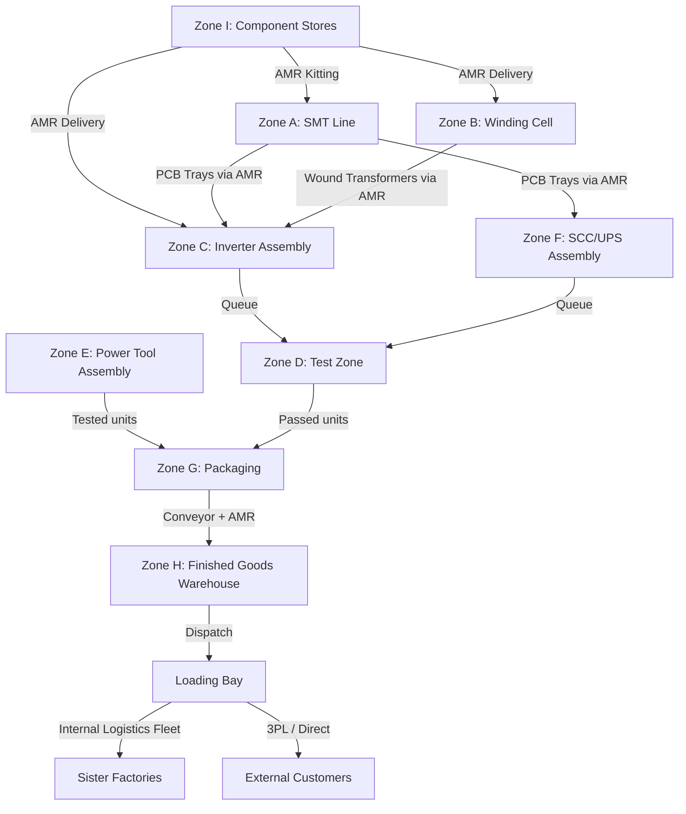

# Factory Floor Plan

**Factory:** Coo-Cah Garage & Power Electronics Factory, Sagamu, Ogun State
**Document Ref:** CCG-PE-FLRP-001 | **Version:** 1.0 | **Phase:** 1
**Total Area:** ~12,000 m²

---

## 1. Site Overview

```
┌─────────────────────────────────────────────────────────────────────────┐
│                         SAGAMU INDUSTRIAL ESTATE                       │
│                                                                         │
│  ┌──────────────────────────────────────────────────────────────────┐  │
│  │              MAIN FACTORY BUILDING  (~8,000 m²)                 │  │
│  │                                                                  │  │
│  │  [ZONE A]   [ZONE B]   [ZONE C]   [ZONE D]   [ZONE E]          │  │
│  │  SMT Line   Winding    Inverter    Test Zone   Power Tool       │  │
│  │  & PCB      Cell       Assembly               Assembly          │  │
│  │                                                                  │  │
│  │  [ZONE F]   [ZONE G]   [ZONE H]   [ZONE I]                     │  │
│  │  SCC/UPS    Packaging  Warehouse  MES Server                    │  │
│  │  Assembly              & Dispatch  Room                         │  │
│  └──────────────────────────────────────────────────────────────────┘  │
│                                                                         │
│  ┌──────────┐  ┌────────────────┐  ┌──────────────────────────────┐   │
│  │ Office & │  │  BESS Pad      │  │  GROUND-MOUNT SOLAR ARRAY    │   │
│  │ Welfare  │  │  (700 kWh LFP) │  │  600 kWp (~3,600 m²)        │   │
│  │  Block   │  │  2×20-ft ctnr  │  │  + Car Park Canopy (~800 m²) │   │
│  │ (~600 m²)│  │                │  │                              │   │
│  └──────────┘  └────────────────┘  └──────────────────────────────┘   │
│                                                                         │
│  ┌───────────────────────┐   ┌─────────────────────────────────────┐  │
│  │  Generator House      │   │   Loading Bay (Inbound + Outbound)  │  │
│  │  400 kVA + 1,500L     │   │   4 × dock doors; AMR interface     │  │
│  │  fuel tank            │   │                                     │  │
│  └───────────────────────┘   └─────────────────────────────────────┘  │
│                                                                         │
│                           MAIN GATE                                    │
└─────────────────────────────────────────────────────────────────────────┘
```

---

## 2. Zone Breakdown

### Zone A — SMT & PCB Production (~1,200 m²)

| Attribute | Detail |
|---|---|
| Area | ~1,200 m² |
| Flooring | ESD conductive epoxy; IEC 61340-5-1 |
| Cleanliness | ISO Class 8 equivalent — positive pressure; filtered air |
| Temperature | 20–25°C controlled (critical for solder paste performance) |
| Humidity | 30–50% RH controlled (moisture-sensitive components) |
| Lighting | 1,000 lux on work surfaces; UV-shielded |
| Equipment | SMT-01 to SMT-12 (see machinery.md) |
| Access | Restricted — smock + ESD wrist strap required |
| AMR Access | Dedicated AMR lane for component kit delivery and PCB tray collection |

**Material Flow:**
```
Component Stores → (AMR kitting) → SMT In-feed → Printer → P&P × 2 → Reflow → AOI → Wave → ICT → Depanel → Output Buffer
```

### Zone B — Transformer & Inductor Winding Cell (~800 m²)

| Attribute | Detail |
|---|---|
| Area | ~800 m² |
| Flooring | ESD epoxy |
| Temperature | 20–30°C; ventilated (varnish fumes) |
| Ventilation | LEV (Local Exhaust Ventilation) at varnish tank; COSHH compliant |
| Equipment | WND-01 to WND-09 (see machinery.md) |
| Staff | ~40 skilled winders (Phase 1 — this is the highest-skill manual zone) |
| Key Note | Transformer winding is the most precision-demanding operation in this factory |

**Material Flow:**
```
Core Stores (toroidal/EI/bobbin) → (AMR delivery) → Winding Machines → 
Varnish Tank → Cure Oven → Transformer Test Station → Output to Zone C
```

### Zone C — Inverter Assembly Line (~1,400 m²)

| Attribute | Detail |
|---|---|
| Area | ~1,400 m² |
| Flooring | ESD epoxy; anti-fatigue mats at standing workstations |
| Layout | 2 parallel assembly lines; 400 m² buffer/WIP storage |
| Equipment | INV-ASM-01 to INV-ASM-07 + CBL-01 to CBL-05 |
| AMR Access | AMR delivers: enclosures from Zone I stores, PCBs from Zone A, transformers from Zone B |

**Line Flow:**
```
Chassis Prep → PCB Mount → Transformer Install → Harness & Terminals → 
Firmware Flash → Pre-test Inspection → (Queue for Zone D) → 
Return from Zone D → Label + Cover → Packaging queue
```

### Zone D — Test Zone — Load Bank, QA, and Calibration (~900 m²)

| Attribute | Detail |
|---|---|
| Area | ~900 m² |
| Sub-zones | Load bank bay (6 × 50 kW banks), Power quality lab, SCC test bench, UPS station, Calibration room |
| Flooring | ESD epoxy + cable trench covers |
| Infrastructure | High-capacity 3-phase power outlets at every load bank station; data network |
| Equipment | TST-01 to TST-13 (see machinery.md) |
| Policy | **100% of every inverter, UPS, and SCC tested before leaving this zone** |

**Test Station Layout:**
```
┌──────────────────────────────────────────────────────────┐
│  LOAD BANK BAY (6 stations × 50 kW each)                │
│  ┌─────┐ ┌─────┐ ┌─────┐ ┌─────┐ ┌─────┐ ┌─────┐      │
│  │LB-1 │ │LB-2 │ │LB-3 │ │LB-4 │ │LB-5 │ │LB-6 │      │
│  └─────┘ └─────┘ └─────┘ └─────┘ └─────┘ └─────┘      │
│                                                          │
│  ┌────────────┐  ┌────────────┐  ┌────────────────────┐ │
│  │ SCC Test   │  │ UPS Test   │  │ Calibration Room   │ │
│  │ Bench ×3   │  │ Station ×2 │  │ (Standards Lab)    │ │
│  └────────────┘  └────────────┘  └────────────────────┘ │
└──────────────────────────────────────────────────────────┘
```

### Zone E — Power Tool Assembly (~700 m²)

| Attribute | Detail |
|---|---|
| Area | ~700 m² |
| Flooring | Standard industrial epoxy (not ESD — power tools not ESD-sensitive) |
| Equipment | PT-ASM-01 to PT-ASM-06 |
| Layout | 1 assembly conveyor (8 m); 6 stations; motor sub-assembly area |
| Noise | Acoustic panels on shared wall with Zone D (power tool testing is noisy) |

### Zone F — SCC & UPS Assembly (~600 m²)

| Attribute | Detail |
|---|---|
| Area | ~600 m² |
| Flooring | ESD epoxy |
| Layout | 4 SCC assembly benches; 2 UPS assembly stations; firmware area |
| Equipment | SCC-ASM-01 to SCC-ASM-03 + UPS jigs |
| Flow | PCBs from Zone A → SCC/UPS assembly → Zone D for testing |

### Zone G — Packaging (~500 m²)

| Attribute | Detail |
|---|---|
| Area | ~500 m² |
| Flooring | Standard epoxy |
| Equipment | PKG-01 to PKG-06 |
| Integration | AMR delivers tested units from Zone D; cartons move to Zone H on conveyor |

### Zone H — Finished Goods Warehouse & Dispatch (~1,200 m²)

| Attribute | Detail |
|---|---|
| Area | ~1,200 m² |
| Racking | 4-tier selective pallet racking; ~3,600 pallet positions |
| Temperature | Ambient; ventilated |
| Loading Bays | 4 × dock-leveller doors; truck access from east side |
| AMR Access | Full AMR zone; Geek+ P40 fleet serves all racking |
| WMS | MES-integrated inventory management; FIFO enforcement |
| Security | CCTV; access control; 24-hour security post |

### Zone I — Component Stores & Incoming QC (~800 m²)

| Attribute | Detail |
|---|---|
| Area | ~800 m² |
| Sub-zones | Semiconductor bonded store (air-conditioned; 18–22°C for MSD components); general component store; incoming QC bench |
| Humidity Control | 40–60% RH in semiconductor store (IPC/JEDEC MSL requirements) |
| DG Storage | Separate locked cage for UPS VRLA batteries (IMDG compliant) |
| AMR Interface | Primary AMR loading zone; all kitting jobs originate here |

### Zone J — MES Server Room & IT (~200 m²)

| Attribute | Detail |
|---|---|
| Area | ~200 m² |
| Temperature | 18–22°C; dedicated precision AC (N+1) |
| UPS Protection | 2 × CCG-UPS 2kVA (internal use — dogfooding) |
| Network | Dual 10 GbE uplinks; factory-wide Wi-Fi 6 mesh; OT network segregated |
| Systems | MES servers, digital twin engine, AMR RCS, EMS |

---

## 3. Material Flow Summary



---

## 4. Infrastructure & Services

### 4.1 Electrical Distribution

| Board | Location | Capacity | Feeds |
|---|---|---|---|
| MDB (Main Distribution Board) | Main LV room | 2,000 A TPN | All sub-boards + solar/BESS tie |
| SMDB-A | Zone A (SMT) | 400 A | SMT line, cleanroom AC |
| SMDB-B | Zone B (Winding) | 200 A | Winding machines, varnish tank, LEV |
| SMDB-C | Zone C/D/E/F | 630 A | Assembly lines, load banks, test equipment |
| SMDB-G/H | Zone G/H | 200 A | Packaging, warehouse |
| SMDB-I/J | Zone I/J | 100 A | Stores, server room, offices |
| SMDB-ENE | Energy Room | 800 A | Solar inverters, BESS, ATS, generator tie |

### 4.2 Compressed Air Network

| Parameter | Value |
|---|---|
| Source | 110 kW rotary screw compressor + 500 L receiver + desiccant dryer |
| Pressure | 7 bar distribution; regulators at each tool point |
| Dewpoint | -40°C (desiccant dryer) |
| Distribution | Aluminium alloy ring main (Prevost or equivalent); drop legs at each zone |
| Key Consumers | SMT (selective solder flux, depanelling), winding (air cooling), assembly (pneumatic tools) |

### 4.3 Data & Network Infrastructure

| Network | Type | Purpose |
|---|---|---|
| OT Network (Zone A–G) | Gigabit Ethernet (wired); VLAN isolated | Machine data, AMR comms, MES terminals |
| IT Network (Zones H–J, offices) | Gigabit Ethernet + Wi-Fi 6 | ERP, email, engineering |
| AMR Network | Wi-Fi 6 (5 GHz dedicated SSID) | Geek+ RCS to AMR comms |
| SCADA/EMS | Modbus TCP + EtherNet/IP | Energy monitoring, BESS, solar inverters |
| Firewall | Fortinet or equivalent | OT/IT segmentation; remote access via VPN only |

---

## 5. Safety & Compliance Features

| Feature | Standard | Notes |
|---|---|---|
| Fire suppression — SMT zone | BS EN 12094 / FM-200 clean agent | Protects SMT machines and component stores |
| Fire suppression — BESS pad | Integrated aerosol + CO₂; automatic | BESS container-integrated |
| ESD flooring — all production zones | IEC 61340-5-1 | Tested monthly; resistance records in MES |
| Emergency exits | BS 5266 / NFPA 101 | ≤ 25 m travel to nearest exit; illuminated |
| LEV (Local Exhaust Ventilation) | COSHH / SON EHS guidelines | At varnish tank, wave solder, rework stations |
| First aid room | SON / NESREA | ~30 m² adjacent to welfare block |
| Chemical store | NFPA 30 / NESREA | Locked; ventilated; spill containment bund |
| Battery (DG) store | IMDG / NESREA | Separate cage in Zone I; ventilated; signage |
| Security perimeter | Perimeter wall; CCTV; access control | 24-hour security; visitor management system |

---

## 6. Future Expansion (Phase 2 & 3)

```
┌──────────────────────────────────────────────────────────────┐
│  Phase 1 Factory Footprint: ~8,000 m² building              │
│  Phase 2 Extension: +2,000 m² (east wing — CNC winding)    │
│  Phase 3 Extension: +2,000 m² (north — lights-out block)   │
│  Solar Expansion: Additional 200 kWp possible on Phase 2    │
│  land to the north if Phase 3 pushes demand to ~600 kW peak │
└──────────────────────────────────────────────────────────────┘
```

Phase 2 additions:
- CNC transformer winding hall (separate climate-controlled bay)
- Expanded test zone for 500+ units/day throughput
- Additional SMT line capacity

Phase 3 additions:
- Lights-out power strip and UPS assembly block (fully AMR-served)
- Automated packaging gantry for power strips at 1.5M units/year
