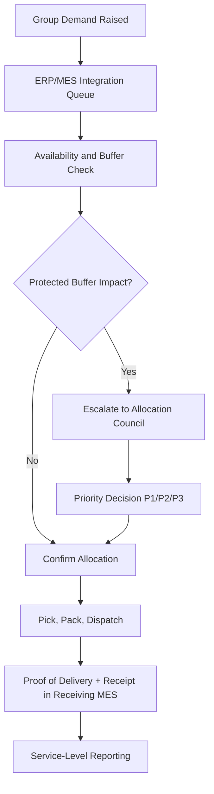

# Intra-Group Supply Coordination

**Factory:** Coo-Cah Garage & Power Electronics Factory, Sagamu, Ogun State  
**Repository:** `coo-cah-factory-electronics-power`  
**Document Ref:** CCG-PE-IGSC-001 | **Version:** 1.0

---

## 1. Purpose

This document defines how the Garage & Power Electronics factory coordinates internal demand and
supply with sister factories in the Coo-Cah network, with priority on Tier 1 operational
continuity and MES-driven fulfilment discipline.

---

## 2. Internal Supply Role

The Sagamu power-electronics factory is an internal strategic supplier for:
- backup power resilience (inverters, UPS),
- solar-control infrastructure (MPPT controllers),
- and operational utility products (smart strips, power tools).

Internal factory demand is prioritised ahead of external commercial allocations until protected
intra-group service levels are met.

---

## 3. Intra-Group Demand Channels

| Receiving Group | Primary Products | Typical Trigger |
|---|---|---|
| Sister factory operations teams | CCG-INV-PSW 3kVA/5kVA, CCG-UPS 1kVA | New line commissioning, replacement cycles |
| Group energy deployment teams | CCG-SCC-MPPT 40A/60A, CCG-INV-PSW | Solar rollout and expansion projects |
| Factory IT and maintenance teams | CCG-PS smart strips, power tools | Workspace expansion, maintenance replenishment |
| Group projects and PMO | Mixed SKU bundles | New-factory launch kits and recovery stock |

---

## 4. Service Levels and Allocation Rules

### 4.1 Internal SLA Targets

| Metric | Target |
|---|---|
| Order acknowledgement | ≤ 4 business hours |
| Pick/pack start (stocked SKUs) | ≤ 24 hours |
| Dispatch readiness (Lagos/Ogun corridor) | ≤ 48 hours |
| Dispatch readiness (non-corridor Nigeria) | ≤ 72 hours |
| Line-fill rate for protected SKUs | ≥ 95% |

### 4.2 Allocation Priority

| Priority Level | Demand Class | Rule |
|---|---|---|
| P1 | Critical uptime requests (factory outages, server-room UPS failures) | Immediate reservation from protected buffer stock |
| P2 | Planned internal deployment projects | Allocated from committed production windows |
| P3 | External commercial sales | Released only after P1/P2 commitments are protected |

---

## 5. SKU Protection Buffers

| SKU Family | Protected Internal Buffer | Rationale |
|---|---|---|
| CCG-INV-PSW (3kVA/5kVA) | 30 days internal forecast | Critical backup power for sister factories |
| CCG-UPS (1kVA) | 45 days internal forecast | MES/IT room continuity and replacement urgency |
| CCG-SCC-MPPT (40A/60A) | 30 days internal forecast | Group solar deployment dependency |
| CCG-PS (6-way) | 21 days internal forecast | High-volume workstation need across sites |
| CCG-PT-DRILL / CCG-PT-AG | 21 days internal forecast | Maintenance readiness across plants |

---

## 6. Coordination Workflow (MES + Group Orchestration)

---

## 7. Escalation and Governance

| Escalation Trigger | Owner | Response Time |
|---|---|---|
| Internal order misses SLA risk | Factory supply chain lead | 4 hours |
| Buffer breach risk on protected SKUs | Factory GM + group operations | Same business day |
| Conflict between internal and external demand | Allocation council | Same business day |
| Repeated late delivery pattern | Group operations leadership | Weekly review cycle |

---

## 8. Data and KPI Reporting

| KPI | Definition | Frequency |
|---|---|---|
| Internal OTIF | On-time in-full rate for intra-group shipments | Weekly |
| Protected SKU cover | Days of protected stock vs policy target | Daily |
| Allocation override count | Number of P3 orders deferred for P1/P2 commitments | Weekly |
| Internal backlog age | Days open for intra-group unfulfilled orders | Daily |
| Supply incident closure time | Time from escalation to recovery plan sign-off | Monthly |

---

## 9. Interface with External Supply

Intra-group fulfilment is sustained by upstream controls already defined in
[Supply Chain Strategy](./supply-chain.md), including:
- 90-day semiconductor safety stock,
- 60-day transformer core buffers,
- and 1–2 day enclosure replenishment from Coo-Cah Plastics & Polymers.

Where upstream disruption threatens internal SLAs, the factory shifts to:
1. protected-SKU-only production windows,
2. temporary external allocation freeze,
3. daily exception reporting to group operations.

---

## 10. Related Documents

- [Supply Chain Strategy](./supply-chain.md)
- [MES Integration](./mes-integration.md)
- [Gap Closure Report](./gap-closure-report.md)
- [Implementation Plan](../implementation-plan.md)

