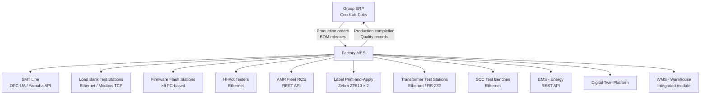

# MES Integration

**Factory:** Coo-Cah Garage & Power Electronics Factory, Sagamu, Ogun State
**Document Ref:** CCG-PE-MES-001 | **Version:** 1.0

> This document follows the Coo-Cah group MES integration standards defined in
> `docs/mes/integration-standards.md` within [Coo-Kah-Doks](https://github.com/oumar-code/Coo-Kah-Doks).
> The MES is deployed from Day 1 of production — not retrofitted.

---

## 1. MES Architecture Overview



---

## 2. Serial Number Traceability System

### 2.1 Serial Number Format

Every Coo-Cah power electronics unit carries a unique serial number generated by the MES at
the start of the production work order.

```
Serial Number Format:  CCG-[SKU]-[YYYY][MM][NNNNNN]

Example:              CCG-INV-PSW-2K-202603001247

Where:
  CCG          = Coo-Cah Group prefix
  INV-PSW-2K   = SKU code (inverter PSW 2kVA)
  2026         = Year of manufacture
  03           = Month of manufacture
  001247       = 6-digit sequential number (resets monthly)
```

| SKU Code | Serial Format |
|---|---|
| CCG-INV-PSW (all sizes) | CCG-INV-PSW-[SIZE]-[YYYYMM][NNNNNN] |
| CCG-INV-MSW | CCG-INV-MSW-[SIZE]-[YYYYMM][NNNNNN] |
| CCG-SCC-MPPT | CCG-SCC-MPPT-[AMPS]-[YYYYMM][NNNNNN] |
| CCG-SCC-PWM | CCG-SCC-PWM-[AMPS]-[YYYYMM][NNNNNN] |
| CCG-UPS | CCG-UPS-[VA]-[YYYYMM][NNNNNN] |
| CCG-PS | CCG-PS-[WAYS]-[YYYYMM][NNNNNN] |
| CCG-BC | CCG-BC-[VOLT]-[YYYYMM][NNNNNN] |
| CCG-PT-DRILL | CCG-PT-DRILL-[WATTS]-[YYYYMM][NNNNNN] |
| CCG-PT-AG | CCG-PT-AG-[SIZE]-[YYYYMM][NNNNNN] |
| CCG-PT-CS | CCG-PT-CS-[SIZE]-[YYYYMM][NNNNNN] |

### 2.2 Serial Number Life Cycle

```
Work Order Created (MES) → Serial Number Generated
        ↓
Chassis Label Printed (barcode + QR) → Applied at assembly start
        ↓
Each Production Step Scanned → MES records station, operator, timestamp
        ↓
Firmware Flash → Serial + FW version + MCU ID linked in MES
        ↓
Transformer Test → Winding test result linked to serial
        ↓
Hi-Pot Test → Hi-Pot result linked to serial
        ↓
Load Bank Test → Full test certificate linked to serial
        ↓
SON Label Printed → C-Mark label with serial QR generated by MES
        ↓
Unit Shipped → Dispatch record links serial to customer order
        ↓
Warranty Claim (if any) → Serial looked up; full birth certificate retrieved
```

### 2.3 Unit "Birth Certificate" — Complete Traceability Record

Every unit that leaves the factory has a complete MES birth certificate accessible via serial
number lookup (QR code on label → Coo-Cah warranty portal → unit history):

| Field | Recorded In MES |
|---|---|
| Serial number | Yes |
| SKU code + description | Yes |
| Date of manufacture | Yes |
| Production work order | Yes |
| BOM revision | Yes |
| PCB lot number (bare board) | Yes |
| Transformer winding batch | Yes |
| Firmware version | Yes |
| Firmware flash date + station | Yes |
| Hi-Pot test result + date | Yes |
| Load bank test result + parameters | Yes — full waveform data archived |
| SON NIS certificate number | Yes |
| QC operator IDs at each stage | Yes |
| Customer order reference (at dispatch) | Yes |
| Warranty start date | Yes |

---

## 3. Load Bank Test Integration — IEC 62040 Test Records in MES

### 3.1 Test Station Ethernet Integration

Every load bank test station is network-connected and integrated with the MES via Modbus TCP
or a direct API. The test process is:

```
Operator scans unit serial number at test station
        ↓
MES retrieves product specification for this SKU
        ↓
Test station receives test parameters (load profile, duration, acceptance limits)
        ↓
Test runs automatically (operator supervises)
        ↓
Test data uploaded to MES in real time:
  - Timestamp start/end
  - Output voltage (V) at each load step
  - Output frequency (Hz)
  - THD (%) at rated load
  - Efficiency (%) at 50% and 100% load
  - Battery backup time (minutes at rated load)
  - Transfer time (ms — for UPS)
  - Temperature at test end (°C via thermal camera scan)
  - Pass / Fail verdict
        ↓
If PASS → MES marks unit "READY FOR LABEL"
          → Label printer triggered automatically
          → SON C-Mark label printed with serial + test date
        ↓
If FAIL → MES raises NCR (Non-Conformance Report)
         → Unit tagged with red "FAIL" label (barcode)
         → AI Diagnostic Engine consulted (Phase 3) or technician review (Phase 1)
         → Repair action recorded in MES
         → Unit re-tested (new test record linked to same serial with REPAIR flag)
```

### 3.2 IEC 62040 Test Record Structure

For IEC 62040-3 compliance (inverter and UPS performance standard), MES records the following
mandatory data per unit:

| IEC 62040-3 Parameter | MES Field | Acceptance Limit (CCG-INV-PSW) |
|---|---|---|
| Output voltage (no load) | `v_output_noload` | 230 V ± 2% |
| Output voltage (full load) | `v_output_fullload` | 230 V ± 2% |
| Output frequency | `freq_hz` | 50.0 ± 0.5 Hz |
| Output THD (linear load) | `thd_pct_linear` | < 5% (CCG target: < 3%) |
| Output THD (non-linear load) | `thd_pct_nonlinear` | < 8% |
| Efficiency at 25% load | `efficiency_25pct` | — (recorded for data) |
| Efficiency at 50% load | `efficiency_50pct` | > 85% |
| Efficiency at 100% load | `efficiency_100pct` | > 82% |
| Crest factor capability | `crest_factor` | ≥ 3:1 |
| Battery backup time | `backup_time_min` | Per model spec ± 10% |
| Transfer time battery→mains | `transfer_time_ms` | < 20 ms (VFI type) |
| Overload hold time (110%) | `overload_110pct_min` | ≥ 10 minutes |
| Hi-Pot test result | `hipot_pass` | PASS (3,000 V AC, 1 min) |
| Peak temperature (thermal scan) | `peak_temp_c` | < 70°C at 100% load |
| Test duration | `test_duration_min` | ≥ 30 minutes |
| Test result | `test_verdict` | PASS / FAIL |
| Retest (if applicable) | `retest_count` | 0 = first test; 1+ = retested |

### 3.3 SCC Test Bench Integration (IEC 61683)

| IEC 61683 Parameter | MES Field | Acceptance Limit (MPPT 40A) |
|---|---|---|
| MPPT tracking efficiency | `mppt_efficiency_pct` | ≥ 97% |
| Charge current accuracy | `charge_current_error_pct` | ± 2% |
| Temperature compensation | `temp_comp_mv_per_c` | -3 mV/°C/cell (12V system) |
| Equalization voltage accuracy | `eq_voltage_error_pct` | ± 1% |
| Float voltage accuracy | `float_voltage_error_pct` | ± 1% |
| Over-voltage protection trip | `ovp_trip_v` | Within spec ± 2% |
| Reverse polarity protection | `rvs_polarity_pass` | PASS |
| Hi-Pot result | `hipot_pass` | PASS |
| Test result | `test_verdict` | PASS / FAIL |

---

## 4. Firmware Flash Records in MES

### 4.1 Flash Station Integration

Each firmware flash station is a PC running the flash management software, integrated with MES
via REST API. The flash workflow:

```
Operator scans unit serial
        ↓
MES confirms:
  - Correct SKU for this serial
  - Approved firmware version for this SKU
  - Any previous flash attempts on this serial
        ↓
Flash software downloads firmware image from MES (not stored locally)
  — This prevents stale firmware being flashed —
        ↓
Flash executes via J-Link / ST-Link programmer
        ↓
Flash software reads back MCU unique ID (UID) and checksum
        ↓
MES records:
  - serial_number
  - sku_code
  - firmware_version (e.g., "CCG-INV-PSW-v2.3.1")
  - firmware_checksum (SHA-256)
  - mcu_uid (STM32 unique device ID)
  - flash_station_id
  - operator_id
  - flash_timestamp
  - flash_result: PASS / FAIL
        ↓
If FLASH FAIL → NCR raised; unit quarantined; hardware fault suspected
If FLASH PASS → Unit proceeds to load bank test queue
```

### 4.2 Firmware Version Control

| Requirement | Implementation |
|---|---|
| Firmware source of truth | MES firmware vault (version-controlled; signed releases only) |
| Approved firmware per SKU | Firmware-to-SKU mapping table in MES; only approved versions can be flashed |
| Field firmware update tracking | OTA updates (Phase 2 feature for Wi-Fi inverter models) linked to serial in MES |
| Firmware recall | If firmware defect found: MES can identify all units with affected FW version from serial DB |

---

## 5. SON Label Print-and-Apply Integration

### 5.1 Label Trigger Logic

```
Load Bank Test PASSES (MES verdict = "PASS")
        ↓
MES generates label payload:
  - SON C-Mark logo flag
  - NIS Certificate Number (auto-populated from product master)
  - Serial Number
  - QR Code (encodes: serial + warranty portal URL)
  - SKU description
  - Manufacturing date (MM/YYYY)
  - "MADE IN NIGERIA — COO-CAH TECHNOLOGIES"
  - Rated specifications (voltage, current, frequency, power)
        ↓
MES sends print job to Zebra ZT610 label printer at packaging station
        ↓
Label printed and applied (manual apply Phase 1; auto-apply Phase 2)
        ↓
MES records: label_printed_timestamp; label_version; label_printer_id
        ↓
Unit moves to packaging
```

### 5.2 Label Specifications

| Label Parameter | Specification |
|---|---|
| Label material | Polyester (for durability; outdoor-rated for SCC/inverter products) |
| Adhesive | Permanent acrylic; temperature range -40°C to +85°C |
| Print method | Thermal transfer (ribbon); 300 DPI resolution |
| QR code | QR Code version 3 or higher; URL to `warranty.coo-cah.com/[serial]` |
| SON C-Mark | As per SON logo usage guidelines; minimum 12 mm diameter |
| NCC label (Wi-Fi products) | Separate NCC label with Type Approval certificate number |

---

## 6. NCR (Non-Conformance Report) Workflow in MES

When a unit fails any test, the MES raises an NCR automatically:

| Step | Action | MES Field |
|---|---|---|
| 1 | Failure detected (load bank, hi-pot, visual inspection) | `ncr_trigger_event` |
| 2 | NCR raised with failure details | `ncr_id`, `ncr_type`, `failure_description` |
| 3 | Unit tagged with red barcode (FAIL label) | `unit_status = QUARANTINED` |
| 4 | Diagnosis performed (technician entry) | `diagnosis`, `probable_cause` |
| 5 | Repair action authorised | `repair_authorised_by`, `repair_action` |
| 6 | Repair completed | `repair_completed_timestamp`, `repair_technician_id` |
| 7 | Re-test performed | Links new test record to same serial with `retest_flag = TRUE` |
| 8 | NCR closed or unit scrapped | `ncr_disposition`: REPAIRED / SCRAPPED |
| 9 | Root cause recorded for SPC | `root_cause_category` (8 categories defined) |

### 6.1 NCR Root Cause Categories

| Code | Category | Examples |
|---|---|---|
| RC-01 | Component defect | Defective MOSFET, bad capacitor, counterfeit IC |
| RC-02 | Winding defect | Wrong turns count, insulation breakdown, shorted layers |
| RC-03 | SMT defect | Solder bridge, missing component, wrong polarity |
| RC-04 | Assembly error | Wrong PCB installed, missing harness connection |
| RC-05 | Firmware defect | Wrong firmware version, flash corruption |
| RC-06 | Design issue | Systematic failure pattern → engineering change required |
| RC-07 | Test jig issue | Test fixture fault — all re-test after jig calibration |
| RC-08 | Unknown | Requires engineering investigation; escalated |

---

## 7. Intra-Group MES Integration

This factory's MES publishes data to the Coo-Cah group ERP/MES layer (Coo-Kah-Doks integration):

| Data Published | Frequency | Consumed By |
|---|---|---|
| Production completion by SKU | Real-time (per unit) | Group ERP — updates available-to-promise |
| Intra-group shipment dispatch | Per dispatch event | Sister factory MES — triggers inbound receipt |
| Quality KPIs (daily FPY, load bank pass rate) | Daily | Group quality dashboard |
| Component inventory levels (critical items) | Real-time | Group supply chain visibility |
| Firmware versions deployed in field | Per shipment batch | Group software management |
| Energy consumption (kWh/unit) | Daily | Group sustainability reporting |

---

## 8. MES Disaster Recovery & Uptime Requirements

| Requirement | Specification |
|---|---|
| MES uptime target | 99.5% (< 44 hours downtime/year) |
| Backup servers | N+1 server redundancy in Zone J server room |
| Data backup | Continuous replication to offsite (group cloud backup); 4-hour RPO |
| UPS protection | 2 × CCG-UPS 2kVA on server room PDUs (factory's own product — dogfooding) |
| Offline mode | Offline forms (paper-based fallback) for serial tracking during MES outage; max 4 hours |
| Recovery time objective | < 2 hours for MES restore from backup |
| Audit log | All MES transactions immutable; ISO 9001 audit trail; retained 10 years |
