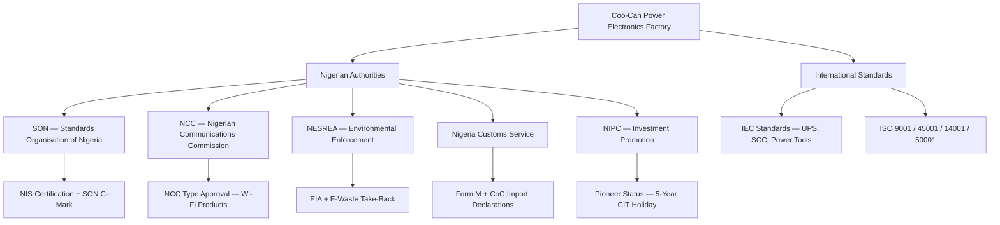
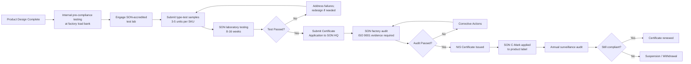
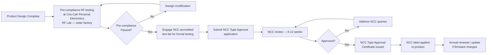

# Regulatory & Compliance

**Factory:** Coo-Cah Garage & Power Electronics Factory, Sagamu, Ogun State
**Document Ref:** CCG-PE-REGL-001 | **Version:** 1.0

> This document covers all Nigerian regulatory requirements and international standards applicable
> to the Coo-Cah Garage & Power Electronics Factory. It is consistent with the group compliance
> framework in [Coo-Kah-Doks](https://github.com/oumar-code/Coo-Kah-Doks).

---

## 1. Regulatory Overview

---

## 2. SON (Standards Organisation of Nigeria)

### 2.1 Overview

SON is the primary product standards authority in Nigeria. **NIS certification is MANDATORY
before commercial sale of all Coo-Cah power electronics products.** Non-certified products
cannot legally be placed on the Nigerian market.

### 2.2 NIS Certification Process

### 2.3 Key NIS Standards by Product

| Product | NIS Standard | IEC Basis | Scope |
|---|---|---|---|
| CCG-INV-PSW / MSW | NIS 411 | IEC 62040-1 / 62040-2 / 62040-3 | UPS and inverter safety, EMC, performance |
| CCG-SCC-MPPT / PWM | NIS for PV systems | IEC 61683 | Photovoltaic system power conditioners |
| CCG-UPS | NIS 411 | IEC 62040-1 / 62040-2 / 62040-3 | UPS safety, EMC, performance |
| CCG-PS | NIS for power strips | IEC 60884-1 | Plugs, socket-outlets, and wiring devices |
| CCG-BC | NIS for battery chargers | IEC 61851-1 | Battery charging |
| CCG-PT-DRILL | NIS for power tools | IEC 60745-1 + IEC 60745-2-1 | Electric drill safety |
| CCG-PT-AG | NIS for power tools | IEC 60745-1 + IEC 60745-2-3 | Angle grinder safety |
| CCG-PT-CS | NIS for power tools | IEC 60745-1 + IEC 60745-2-5 | Circular saw safety |

### 2.4 SON C-Mark Labelling Requirements

Every certified product must display the SON C-Mark on:
- Product body (moulded-in or permanent label)
- Product packaging
- User manual / documentation

The MES system triggers the label print-and-apply station after each unit passes the load bank
test. The label includes:
- SON C-Mark logo
- NIS certificate number
- Product serial number (QR code linking to MES traceability record)
- Manufacturing date (MM/YYYY)
- "MADE IN NIGERIA — COO-CAH TECHNOLOGIES"

### 2.5 SON Certification Timeline

| SKU Priority | Target Submission | Target Certificate |
|---|---|---|
| CCG-INV-PSW 2kVA + 3kVA | Q4 2026 | Q2 2027 |
| CCG-SCC-MPPT 40A + 60A | Q4 2026 | Q2 2027 |
| CCG-PS 4-way + 6-way | Q4 2026 | Q1 2027 (simpler product) |
| CCG-UPS 1kVA | Q1 2027 | Q3 2027 |
| All other SKUs | Q1–Q2 2027 | Q3–Q4 2027 |

### 2.6 SON Certificate of Conformity (CoC) for Imports

Separately from product certification, SON requires a **CoC for controlled product imports**.
This affects incoming components:
- Semiconductors (above declared value threshold)
- PCB bare boards
- Transformer cores (if classified as electrical materials)

The factory's procurement team manages Form M + SON CoC declarations in conjunction with the
licensed clearing agent at Tin Can Island Port and the air freight agent at MMIA (Lagos).

---

## 3. IEC Standards — Detailed Breakdown

### 3.1 IEC 62040 — UPS and Inverters (Three-Part Standard)

| Part | Standard | Scope |
|---|---|---|
| **IEC 62040-1** | Safety requirements | Isolation, touch safety, earthing, thermal limits, fault conditions, enclosure protection (IP rating) |
| **IEC 62040-2** | EMC (Electromagnetic Compatibility) | Conducted emissions (CISPR 22 Class B for residential), radiated emissions, immunity (ESD, surge, EFT, conducted RF) |
| **IEC 62040-3** | Performance and test methods | Voltage regulation, frequency accuracy, waveform THD (< 5% for PSW), efficiency, transfer time, overload capacity, backup time |

**Key performance requirements (IEC 62040-3) for CCG-INV-PSW:**

| Parameter | Requirement | Coo-Cah Target |
|---|---|---|
| Output voltage | 230 V ± 2% (no-load to full-load) | ± 1.5% |
| Output frequency | 50 Hz ± 0.5 Hz | ± 0.3 Hz |
| Output waveform (THD) | < 5% at linear load | < 3% |
| Efficiency (at 50% load) | > 85% | > 88% |
| Transfer time (battery to mains) | < 20 ms (VFI class) | < 10 ms |
| Overload capacity | 110% for 10 min; 125% for 60 s | 120% for 10 min |

### 3.2 IEC 61683 — Solar Charge Controllers

| Parameter | Requirement |
|---|---|
| MPPT tracking efficiency | ≥ 97% |
| Charge accuracy | ± 2% of set point |
| Temperature compensation | -3 mV/°C/cell |
| Protection | Over-voltage, reverse polarity, short-circuit, over-temperature |
| Display / Communication | LCD display; optional RS232/Modbus RTU |

### 3.3 IEC 60745 — Power Tools (Three-Part Structure)

| Standard | Scope | Key Test |
|---|---|---|
| IEC 60745-1 | General requirements — all power tools | Dielectric strength; insulation resistance; moisture ingress; mechanical strength; temperature rise |
| IEC 60745-2-1 | Drills and hammer drills | Spindle bearing test; switch endurance; anti-restart test |
| IEC 60745-2-3 | Angle grinders | Wheel burst containment test; guard retention test |
| IEC 60745-2-5 | Circular saws | Blade guard test; anti-kickback test; riving knife test |

### 3.4 IEC 60884-1 — Power Strips (Plugs and Socket-Outlets)

| Test | Requirement |
|---|---|
| Current carrying capacity | Rated current without exceeding temperature rise limits |
| Fault current withstand | 1,000 A for 0.2 s |
| Dielectric strength | 2,500 V AC for 1 minute |
| Earth continuity | < 0.1 Ω |
| Switch endurance (CCG-PS Wi-Fi model) | 10,000 switching cycles |
| Surge protection (CCG-PS) | IEC 61643-11; SPD Type 3; Uc ≥ 275 V; Up ≤ 1.5 kV |

---

## 4. NCC (Nigerian Communications Commission) — Type Approval

### 4.1 Applicability

NCC Type Approval is required for all equipment that uses radio frequency (RF) spectrum in Nigeria.
This applies to:
- **CCG-PS smart power strips** — Wi-Fi (2.4 GHz / 5 GHz) for individual outlet switching
- **CCG-INV-PSW Wi-Fi models** — Wi-Fi for remote monitoring via mobile app

### 4.2 NCC Type Approval Process

### 4.3 NCC Technical Requirements

| Parameter | Requirement |
|---|---|
| Frequency band (Wi-Fi 2.4 GHz) | 2,400–2,483.5 MHz |
| Frequency band (Wi-Fi 5 GHz) | 5,150–5,250 MHz and 5,470–5,725 MHz |
| Maximum transmit power | 100 mW EIRP (2.4 GHz); 200 mW EIRP (5 GHz) |
| Spurious emissions | IEC/CISPR 32 |
| Radiated emissions | CISPR 22 / EN 55032 Class B |
| Conducted emissions | CISPR 22 / EN 55032 Class B |

### 4.4 Coo-Cah Personal Electronics RF Lab

The **Coo-Cah Personal Electronics Factory** (sister factory) operates an **RF pre-compliance lab**
that performs testing equivalent to an anechoic chamber environment. This is used for:
- Pre-compliance radiated emissions measurement
- Antenna performance characterisation
- Conducted emissions (bench testing)
- ESD and EFT immunity pre-screening

**Benefit:** Coo-Cah Electronics avoids paying external anechoic chamber time (~$8,000–15,000
per test session) for pre-compliance iterations. The RF lab screens products before formal
submission to the NCC-accredited external lab — significantly reducing the cost and time of
achieving NCC Type Approval.

---

## 5. NESREA (National Environmental Standards and Regulations Enforcement Agency)

### 5.1 Environmental Impact Assessment (EIA)

An EIA is **mandatory before construction begins** under NESREA Act 2007 and the Environmental
Impact Assessment Act Cap E12 LFN 2004.

| EIA Stage | Requirement | Timeline |
|---|---|---|
| Screening | Determine EIA category (Category B — moderate impact) | At design stage |
| Scoping | Identify significant impacts and stakeholders | Q3 2025 |
| EIA Study | Baseline survey; impact assessment; mitigation measures | Q3–Q4 2025 |
| Public Consultation | Stakeholder meetings; public review period (21 days) | Q4 2025 |
| NESREA Review | Technical review of EIA report | Q1 2026 |
| EIA Certificate | Issued if EIA approved — prerequisite for construction permit | Q1 2026 |

**Key environmental aspects identified:**
- Solder waste (lead-free — but flux residues require proper disposal)
- Varnish / chemical waste from transformer winding (managed as hazardous waste)
- VRLA battery waste (see section 5.3)
- Electronic waste (customer take-back)
- Noise (generators, compressors — managed by acoustic enclosures)
- Wastewater (general industrial effluent — managed by licensed treatment)

### 5.2 E-Waste Take-Back Scheme

NESREA requires manufacturers of electronic and electrical equipment (EEE) to implement
a **Producer Responsibility take-back scheme** for end-of-life products.

| Requirement | Implementation |
|---|---|
| Take-back scheme registration | Register with NESREA as a Producer under WEEE regulations |
| Take-back coverage | Inverters, UPS, battery chargers, solar charge controllers, power tools |
| Collection points | 1 × factory-level collection point at Sagamu; 2 × regional agents (Lagos, Abuja) |
| Annual NESREA report | Number of units sold vs. units collected and recycled; by December annually |
| Recycling partner | NESREA-licensed e-waste recycler (e.g., GreenCircle Recycling or equivalent Lagos-based licenced firm) |
| Target collection rate | ≥ 20% of previous year's units sold (NESREA minimum) |

### 5.3 VRLA Battery Disposal

UPS batteries (VRLA / SLA) are classified as **hazardous waste** under Nigerian environmental law
due to lead content.

| Requirement | Detail |
|---|---|
| Disposal method | Licensed lead-acid battery recycler only |
| Disposal record | Manifest system — factory keeps copy; recycler files NESREA copy |
| Annual report | Volume of batteries disposed; recycler name and licence number |
| Battery recycler options | Metal Afrika Battery Ltd (Lagos); ACCELAB (Kano); equivalent NESREA-licensed firm |
| Take-back from customers | Factory accepts end-of-life UPS batteries from customers — reduces customer disposal problem; promotes brand trust |
| NESREA permit | Factory holds a waste management permit for hazardous waste generator classification |

---

## 6. Nigeria Customs Service — Import Documentation

| Document | Purpose | Managed By |
|---|---|---|
| **Form M** | Pre-import declaration; mandatory for all imports > $10,000 | Factory procurement team + bank |
| **SON CoC (Certificate of Conformity)** | Required for controlled product categories | SON-accredited CoC agent in country of origin |
| **Combined Certificate of Value and Origin** | Trade compliance | Exporter provides |
| **NAFDAC clearance** | Not required for these products (industrial electronics) | N/A |
| **DPR clearance** | Not required (not petroleum products) | N/A |
| **NESREA hazardous import permit** | For VRLA batteries | Factory Environmental Officer |
| **SON import permit** | For certain controlled electrical components | Factory procurement team |

**Clearing Agent:** Factory will use a licensed customs clearing agent with experience in
electronics and hazardous goods at Tin Can Island Port (sea freight) and MMIA (air freight).

---

## 7. NIPC Pioneer Status Application

### 7.1 Overview

The **Nigerian Investment Promotion Commission (NIPC)** offers Pioneer Status to qualifying
manufacturers. For Coo-Cah Power Electronics Factory, Pioneer Status provides:

| Benefit | Detail |
|---|---|
| **Company Income Tax (CIT) holiday** | 100% CIT exemption for 3 years (renewable to 5 years) |
| **Dividend withholding tax** | Reduced to 10% during pioneer period |
| **Capital allowances** | Accelerated capital allowances on qualifying plant and machinery |
| **Import duty relief** | Potential import duty concessions on qualifying machinery |
| **Estimated CIT saving** | ~₦2.5–4.0 billion over 5-year period (based on projected profitability) |

### 7.2 Qualifying Criteria

| Criterion | Coo-Cah Status |
|---|---|
| Industry sector | ✅ Manufacturing — Renewable Energy Equipment (qualifying sector) |
| Minimum investment | ✅ Phase 1 CapEx >₦4 billion exceeds the ₦50 million minimum |
| Local value addition | ✅ Manufacturing in Nigeria; Nigerian employees; local material sourcing |
| Exports | ✅ Phase 2 export target to ECOWAS market supports case |
| New activity (no existing operations) | ✅ New factory; no existing production of these products |

### 7.3 Application Process

| Step | Action | Timeline |
|---|---|---|
| 1 | Engage NIPC-registered investment promoter / legal counsel | Q2 2025 |
| 2 | Prepare business plan and investment projection | Q2 2025 |
| 3 | Submit Pioneer Status application to NIPC | **Q3 2025 target** |
| 4 | NIPC technical committee review | Q4 2025 |
| 5 | FEC (Federal Executive Council) approval | Q1 2026 |
| 6 | Pioneer Certificate issued | Q1 2026 |
| 7 | Pioneer period begins (from date of first production) | Q3 2026 est. |

### 7.4 Pioneer Status Benefits Table

| Year | CIT Rate (without Pioneer) | CIT Rate (with Pioneer) | Annual CIT Saving (₦) |
|---|---|---|---|
| 2027 (Year 1) | 30% | 0% | ~₦230M |
| 2028 (Year 2) | 30% | 0% | ~₦600M |
| 2029 (Year 3) | 30% | 0% | ~₦1.1B |
| 2030 (Year 4 — renewal) | 30% | 0% | ~₦1.8B |
| 2031 (Year 5 — renewal) | 30% | 0% | ~₦2.6B |
| **5-Year Total** | | | **~₦6.3B** |

---

## 8. Quality Management — ISO 9001:2015

### 8.1 Scope

**ISO 9001:2015 QMS scope:** Design, manufacture, test, and supply of power inverters, solar
charge controllers, UPS, battery chargers, smart power strips, and power tools.

### 8.2 Key QMS Processes

| Process | QMS Element | Phase 1 Implementation |
|---|---|---|
| Design and Development | Clause 8.3 | Product design, FMEA, design review process |
| Supplier Qualification | Clause 8.4 | Semiconductor distributor audit; Coo-Cah Plastics quality agreement |
| Production Control | Clause 8.5 | MES work orders; process instructions; ESD control |
| Test and Inspection | Clause 8.6 | 100% load bank test; incoming QC; final inspection |
| Non-conforming product | Clause 8.7 | NCR (Non-Conformance Report) process in MES; scrap + rework tracking |
| Customer satisfaction | Clause 9.1.2 | Warranty tracking; NPS surveys; field failure reporting |
| Internal audit | Clause 9.2 | Quarterly internal audits; 2× per year before external surveillance |

### 8.3 Certification Timeline

| Milestone | Target Date |
|---|---|
| QMS documentation complete | Q2 2026 |
| QMS implementation (all processes active) | Q3 2026 |
| Internal audit cycle 1 complete | Q4 2026 |
| ISO 9001 pre-audit (gap assessment) | Q4 2026 |
| **ISO 9001:2015 certification audit** | **Q4 2026** |
| Certificate issued | Q1 2027 |

---

## 9. Health & Safety — ISO 45001:2018

| Hazard | Control Measure |
|---|---|
| High-voltage (load bank test zone) | Interlocked test enclosures; PPE (HV gloves); trained operators only; permit-to-work system |
| ESD damage risk | ESD flooring; wrist straps; smocks; monthly ESD audit |
| Chemical exposure (solder flux, varnish) | LEV at all soldering points; COSHH assessment; PPE; regular air monitoring |
| Ergonomic (winding cell) | Anti-fatigue mats; job rotation every 2 hours; ergonomic workstation heights |
| VRLA battery acid | Chemical-resistant gloves; face shields; eyewash stations in Zone I |
| Manual handling (transformer cores) | Lift assists; trained lifting techniques; max manual lift 20 kg; overhead crane for large cores |
| Fire risk (solvents, batteries) | Segregated chemical store; BESS fire suppression; fire detection throughout |
| Noise (generators, power tools) | Acoustic enclosures on generator; hearing protection in Zone E (>85 dB areas) |
